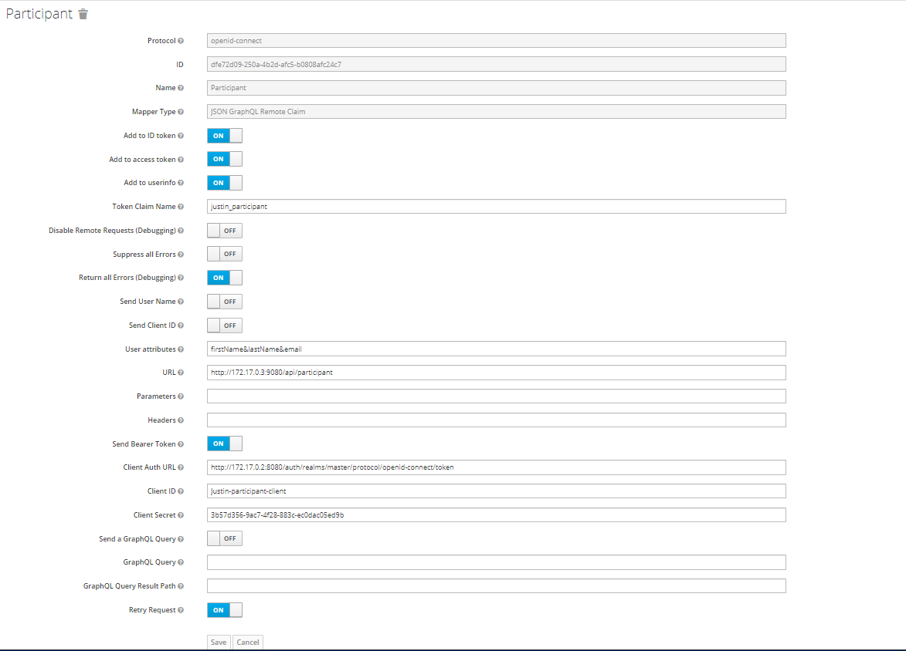

# GraphQL JSON Remote claim Mapper for Keycloak

This module uses the Protocol Mapper SPI for keycloak.

It adds a new mapper type which retrieves a JSON claim from a remote HTTP endpoint (e.g. from a REST API).
This endpoint may be a GraphQL or REST endpoint that uses bearer (JWT) token authentication. 

## Compatibility

This module currently works with Keycloak 10.0.0. For RED HAT SSO, use it's keycloak equivalent based on [RED HAT SSO Keycloak Equivalent](https://access.redhat.com/articles/2342881) 

It is compatible with Keycloak >= 4.6.0 , you may just need to change the keycloak version in the ```pom.xml``` based on the RED HAT SSO equivalent.

For version <= 4.5.0, the module will also work but a functionnality will be unavailable (see <sup>(1)</sup>).

## Install

Start by building the module:

```Bash
mvn clean package
```

### Deploy manually

Build module and then copy the `target/json-graphql-remote-claim.jar` file to `/opt/jboss/keycloak/standalone/deployments/`. 
Keycloak should pick it up automatically and deploy it. 
No restart should be required.

### Deploy in Docker

To deploy automatically in docker, you can use this solution from Meinert Schwartau:

https://github.com/mschwartau/keycloak-custom-protocol-mapper-example

**NOTE**: For remote requests to work, your container's network setup has to 
allow outbound connections! 

For local development `localhost` is 
available from within the container via `host.docker.internal` 
(only on Docker Desktop for Windows/Mac, 
see [here](https://docs.docker.com/docker-for-windows/networking/#use-cases-and-workarounds)). 
For example, if you have development instance of your remote claim service running at `localhost:8082`, 
you can configure the URL parameter in the protocol mapper as `http://host.docker.internal:8082/graphql`. 
(Always use `https` in production.)

## Using the module

To add a JSON claim from a remote HTTP / REST / GraphQL service, 
you just need to add a mapper from client (or client scope) configuration.

Step by step (for authorized GraphQL queries):

1. After deployment of your custom protocol mapper (see above), open the Keycloak Admin UI of your realm.
2. Go to clients and select the client whose authentication tokens you want to enrich with your custom remote claims.
3. Go to "Mappers", click "Create" and select "JSON GraphQL Remote Claim" as "Mapper Type".
    1. `Token Claim Name` is the property name in the token that will contain the remote claim. 
    Example: `custom`
    1. `URL` is the URL of the remote endpoint
    1. `Send Bearer Token`
        1. If enabled, the protocol mapper will obtain an access token from Keycloak and 
        put it into the request headers as `Authorization: Bearer <token>`.
        1. `Client Auth URL` will typically be the URL to Keycloaks token endpoint itself. 
        Example: `http://localhost:8080/auth/realms/demo/protocol/openid-connect/token`
        1. `Client Id` refers to a keycloak client for which the protocol mapper obtains an 
        access token. This client represents the remote endpoint and must not be the same 
        as the client in step 2, to avoid infinite recursion! This client must have `Access Type = confidential` and `Service Accounts Enabled = ON`.
        1. `Client Secret` is the secret from the client credentials page.
    1. `Send a GraphQL Query`
        1. If enabled, the protocol mapper will send the configured GraphQL query as a POST request.
        1. `GraphQL Query` is the query that should be sent. 
        The variables `username` and `client_id` can be used in the query if they are enabled. 
        
            See example: `query myQuery($username: String!){ myQuery(userName: $username) {userName email role}}`
        
        1. `GraphQL Query Result Path` is the result json path that will be mapped to the token claim name. Example: `data.myQuery`
    1. If `Send a GraphQL Query` is disabled, the protocol mapper will send a GET request with regular `<key1>=<val1>&<key2>=<val2>&...` parameters.


**Custom Headers and Parameters**

In GraphQL mode, parameters are passed as GraphQL variables. In GET mode (GraphQL disabled), parameters are passed as regular query string

- Send the username as ```username``` query parameter (*Send user name*)
- Send the client_id of the resource as ```client_id``` query parameter (*Send client ID*)
- Add user attributes as parameters to the query (*User attributes*)
- Add custom query parameters to the request (*Parameters*)
- Add custom HTTP headers to the request (*Headers*)

For headers and query parameters, use ```=``` to separate key and value. You can add multiple parameters (and headers) by separating them with ```&```.

### Screenshots




## Functionalities

- Integration as a protocol mapper in Keycloak dashboard
- Configurable claim path (= claim name)
- Handles any type of JSON object
- Sending username as an option
- Sending client_id as an option
- Custom query parameters
- Custom HTTP headers
- URL configuration
- Error handling: 
    - default behavior: no token delivered if claims are unavailable (error 500 will occur)
    - with `Suppress all Errors` enabled: catches all errors and returns `error` as claim value
- Debugging Options
    - `Disable Remote Requests (Debugging)`: disables all requests and simply returns "disabled" as claim value
    - `Return all Errors (Debugging)`: returns error message as claim value instead of throwing an Error/Exception back at Keycloak
- Configurable Keycloak Client
    - will be used by protocol mapper to obtain access token at runtime. 
    - access token will then be sent to remote endpoint as `Authorization: Bearer <token>`.
    - Keycloak client must not be the one that this protocol mapper is used with. (would otherwise create infinite loop)
    - Keycloak client should be confidential with only "service account flow" enabled, i.e., login with `grant_type` `client_credentials` is enabled.
- Configurable GraphQL query
    - will be sent as HTTP POST request. 
    - username, client_id, and other parameters will be sent as query variables, if enabled
    - result json path is configurable, e.g., `data.a.b.c` corresponds to a nested JSON document where the value of property `c` will be mapped to the claim
- <sup>(1)</sup> Optimization when multiple tokens in the response: needs a single request (example: access_token and id_token in the response)

<sup>(1)</sup> *Only with Keycloak >= 4.6.0*